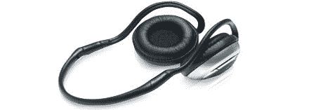

# 通过取消保修来改进耳机

> 原文：<https://hackaday.com/2012/02/05/improving-headphones-by-voiding-warranties/>

[丹]一直想要一副蓝牙耳机。大多数对 50-80 美元无线耳机的评论都抱怨声音微弱，低音下降。然而，他偶然发现了一副 20 美元的耳机，也有类似的评论，并意识到他可以[换掉驱动器](http://blog.danjoannis.com/?p=810)，做出一副像样的易拉罐。

捐赠者的驱动程序来自一对森海瑟 HD 540 耳机。这些都是非常受人尊敬的耳机扬声器的费用约为您所期望的专业音频设备。为了让蓝牙与森海塞尔夫妇一起工作，[丹]拆除了印刷电路板和电池外壳，并与 velcro 一起将它们固定在头带上。

对于他的构建，他必须切断森海塞尔上的电缆，并将它们焊接到蓝牙板上。然而，从来没有任何损坏一副好耳机的危险。如果他搞砸了，他只是一根耳机线。现在【丹】有了一副不错的蓝牙耳机，可以重现低音。对于一副 20 美元的耳机来说，这是一笔不错的交易。