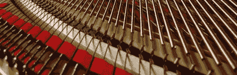

# 自调式钢琴会自己调音，金枪鱼不会吗

> 原文：<https://hackaday.com/2012/02/05/self-tuning-piano-can-tune-itself-cant-tuna-fish/>

在 Hack a Day，我们不会轻易使用天才这个词。我们有义务授予[唐·吉尔摩]这个称号，因为他的自调音钢琴非常简单。要欣赏[唐]的身材，你需要意识到，仅仅因为一架钢琴有 88 个键，并不意味着它有 88 根弦。高音每个键有三根弦，而男高音和低音每个键有一根或两根弦。每架钢琴通常会有 200 多根琴弦，而[Don]可以在一分钟内将它们全部调好。

[Don]的系统需要执行两个功能。第一个是支撑琴弦，这样计算机就能“听到”琴弦。他用一个很像 E 形弓的磁力维持器来做这件事。为了使琴弦达到正确的音高，销座下面有小型加热器。让一点点电流通过这些加热器可以让[Don]降低每根琴弦的张力，降低音调。

这项技术让我们想起了[吉布森机器人吉他](http://www.gibson.com/RobotGuitar/index.html)，这是一种自调音吉他，通过调谐器中的电机来实现它的功能。考虑到每个人和他们的妈妈都会给吉他调音，吉布森在销售场上表现不佳。然而，钢琴是另一个故事。[唐]正在寻找投资者将他的想法推向市场，我们希望在未来的某个时候能在一家音乐商店的地板上看到它。

 <https://www.youtube.com/embed/ugAxXm2SAXw?version=3&rel=1&showsearch=0&showinfo=1&iv_load_policy=1&fs=1&hl=en-US&autohide=2&wmode=transparent>

 
是的，快速马车合唱团的推荐信。只是有点惭愧，如果你想知道的话。
 </body> </html>