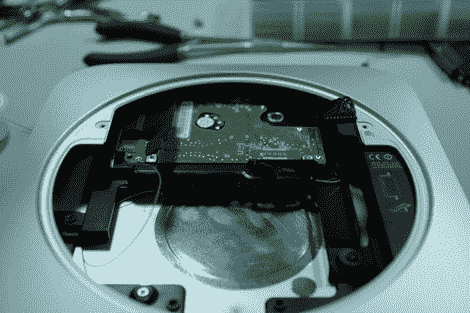

# Mac Mini 的更快硬盘选项

> 原文：<https://hackaday.com/2012/02/06/speedier-hard-disk-option-for-your-mac-mini/>

[Andrew]的 2011 款 Mac Mini 硬盘速度太慢，让他觉得不够用。他开始增加一个 10，000 RPM 的驱动器，我们认为他做得很好。幸运的是[他还花时间记录了这个过程](http://adwiens.com/projects/other/06/macminiraptor.html)，所以你可以自己尝试一下。

与许多苹果产品一样，这种攻击的很大一部分只是把该死的东西拆开，而不是弄坏什么东西。一旦完成，你就要做一点界面黑客。为了节省空间，苹果使用了非标准的 SATA 分线电缆，因此[Andrew]从向该公司订购第二根硬盘电缆开始。然后，他焊接了一根细线，将主板上的 12V 电压连接到 SATA 连接器上的 12V 引脚。从那里它只是一个问题，改变原来的硬盘驱动器雪橇，为 500 GB 的 WD 迅猛龙驱动器腾出空间。它放在原稿下方，作为额外的空间，而不是替代物。