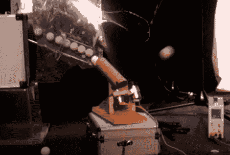

# 推特让你的蛋蛋飞起来(在电视上)

> 原文：<https://hackaday.com/2012/02/07/tweets-send-your-balls-flying-on-tv/>

伦敦黑客空间的成员最近用乒乓球发射器获得了一点直播时间。他们被邀请为英国广播公司的点击节目制作一些东西。他们建造的发射器[通过用球轰炸观众](http://www.electriclaboratory.com/2012/01/14/balls-to-this/)来回应 Twitter 上的散列标签。

硬件由两部分组成。第一个是分配器，它通过将一个球释放到一组暂存斜坡上来响应传入的推文。另一部分是发射器本身。像这样建造它使它成为一个快速发射装置，因为发射器的旋转轮子可以快速发射几十个等待释放的球。看看跳伞后的一些片段。

我们喜欢这个就像那个遥控发射器一样。我们很高兴看到这些，因为自从我们建造了[那个时钟](http://hackaday.com/2011/01/31/how-to-build-a-ping-pong-ball-display/)以来，我们碰巧有剩余的球，而且我们不打算承担一些我们已经看到的[的更危险的乒乓球项目](http://hackaday.com/2009/11/02/ping-pong-launcher-your-wife-cant-know-about/)。 <https://www.youtube.com/embed/iPG-ji3zt7A?version=3&rel=1&showsearch=0&showinfo=1&iv_load_policy=1&fs=1&hl=en-US&autohide=2&wmode=transparent>

 </body> </html>