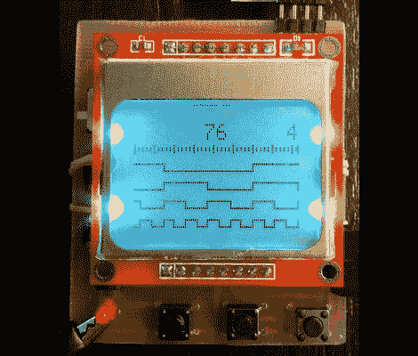

# 构建您自己的 4 通道逻辑分析仪

> 原文：<https://hackaday.com/2012/02/07/build-your-own-4-channel-logic-analyzer/>

如果你刚刚开始对电子产品感兴趣，很有可能会有很多你想得到的工具，但还不能证明购买的合理性。为什么不建造一些更简单的呢？这里有一个 4 通道逻辑分析仪的很好的例子，它可以是你的下一个项目，并将为你未来的努力增加武器库。

正如你所看到的，[瓦西里斯]创作使用手机大小的液晶显示屏作为输出。它由四节可充电电池供电，由 ATmega8 微控制器驱动。他设计了没有电源调节的工具，依靠 ATmega 相当宽的工作电压范围，以及几个二极管来降低 LCD 屏幕的电压。

正如您在中断后的视频中看到的，鳄鱼引线可用于将测试电路连接到输入端(不要忘记接地参考！).底部的按钮允许您通过平移和缩放来导航捕获的数据。也许最好的设计特点是单面电路板，这应该很容易在家里复制。

 <https://www.youtube.com/embed/oep_eB51JPw?version=3&rel=1&showsearch=0&showinfo=1&iv_load_policy=1&fs=1&hl=en-US&autohide=2&wmode=transparent>

 
[via <a href="http://dangerousprototypes.com/2012/02/03/avr-based-4-channel-mini-logic-analyzer" target="_blank">危险原型</a>
 </body> </html>