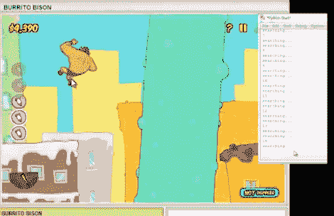

# 用 Python 编写的网页游戏机器人

> 原文：<https://hackaday.com/2012/02/07/web-game-bot-coded-with-python/>

我们发现游戏机器人的编程挑战非常有趣。来看看[这个全程玩卷饼野牛](https://github.com/Audionautics/Burrito-Bot)的 Python 机器人(休息后视频)。这是一个完全学究气的练习，除了磨练你对某个编程问题的掌握之外，没有任何目的。对此我们要说好极了！

我们研究了一个类似的项目，它使用了一些 C#代码来控制游戏《宝石迷阵》。我们对 C#并不擅长，代码也从未公开过。但是[Audionatics]已经通过 Github 发布了这段代码，它是用 Python 写的，Python 是一种我们非常精通的语言。

该脚本监控像素位置以用作输入,[Audionautics]承认这非常容易出错。但是，如果一切都设置得恰到好处，它就像一个魔咒。他还使用了 PyWin 包，我们相信这是让脚本移动光标和注册按钮点击。我们认为这真的很有趣，但它让我们怀疑黑帽的可能性。这有可能变成一个赌博机器人吗？可怕的想法，是吧？

 <https://www.youtube.com/embed/V7UO53ajBc0?version=3&rel=1&showsearch=0&showinfo=1&iv_load_policy=1&fs=1&hl=en-US&autohide=2&wmode=transparent>

 
[via <a href="http://www.reddit.com/r/programming/comments/pb63q/speed_running_web_games_with_python/" target="_blank"> Reddit </a>
 </body> </html>