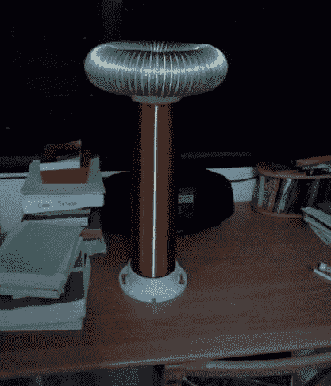

# DIY 固态特斯拉线圈

> 原文：<https://hackaday.com/2012/02/07/diy-solid-state-tesla-coil/>

特斯拉线圈总是很容易看到，而且相对论也很容易制造。虽然有很多关于这个主题的网站，但[迈克尔的]最新指示性突破[将固态特斯拉线圈简化为 12 个简单步骤。](http://www.instructables.com/id/Solid-State-Tesla-Coil/)

任何看过特斯拉线圈的人都应该很熟悉的东西包括 PVC 管、铝导管和电线……很多电线。聚氯乙烯管被切割成一定长度，并附有一个法兰，以帮助形成一个基地。从那里开始，管道被缠绕上大约一磅 30 AWG 的漆包线，这需要一些手工时间来确保线圈之间没有重叠或空隙。

然后将铝管道缠绕在第二个法兰的外部。一些烟囱钢丝穿过管道并扭曲以封闭两端，然后用热熔胶将两端粘在一起。该组件被拧到现在包含大型变压器次级线圈的管道顶部。剩下的就是连接一个由几圈 16 AWG 线组成的初级线圈和控制电路。

休息之后加入我们，观看令人震惊的视频！

 <https://www.youtube.com/embed/2K3Sm85YTck?version=3&rel=1&showsearch=0&showinfo=1&iv_load_policy=1&fs=1&hl=en-US&autohide=2&wmode=transparent>

 </body> </html>