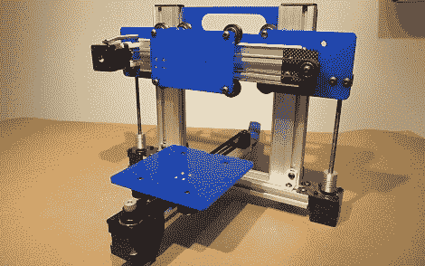

# 又一台 3D 打印机

> 原文：<https://hackaday.com/2012/02/08/yet-another-3d-printer/>

如果你想演示一个直线轴承系统，你会怎么做？如果你像[Bart]一样，显而易见的解决方案是建造一台小型 3D 打印机。[巴特]的量子机器人是根据他以前的项目建造的， [MakerSlide](http://www.makerslide.com/) 直线轴承系统。

用 MakerSlide 材料制作打印机的想法来自于[Bart]对[ORD Camp](http://www.ordcamp.com/)的邀请。这个构建在大约 5 个小时内完成的事实充分说明了 MakerSlide 系统的简单性。现在，打印机是为 NEMA 14 电机设计的，但对于更大的建筑来说，有足够的空间来安装更大的 NEMA 17 步进电机。[Bart]在 buildlog.net 论坛上为他的打印机发布了一个[建造日志](http://www.buildlog.net/forum/viewtopic.php?f=16&t=1035)。

MakerSlide 系统已经在一个开源的[激光切割机项目](http://www.buildlog.net/blog/2011/02/buildlog-net-2-x-laser/)中使用，但是【Bart】真的只是想要一些东西来展示他的线性轴承系统。无论如何，我们喜欢机器人；如今，铝挤压制造的材料不足。

[Bart]将在芝加哥 hackerspace [泵站展示他的机器人:一个](http://pumpingstationone.org/)今晚，2 月 8 日。顺便过来看看。给我们拍几张照片，我们会把它们挂起来。

编辑:[gigawatts121]好心地[发来了一张泵站打印机的图片](http://www.flickr.com/photos/22446672@N00/6845119929/):一张。评论中还有一个校准立方体的视频，由[David]提供。休息之后请继续关注。

[https://www.youtube.com/embed/gP2ebXlK3Ck?version=3&rel=1&showsearch=0&showinfo=1&iv_load_policy=1&fs=1&hl=en-US&autohide=2&wmode=transparent](https://www.youtube.com/embed/gP2ebXlK3Ck?version=3&rel=1&showsearch=0&showinfo=1&iv_load_policy=1&fs=1&hl=en-US&autohide=2&wmode=transparent)