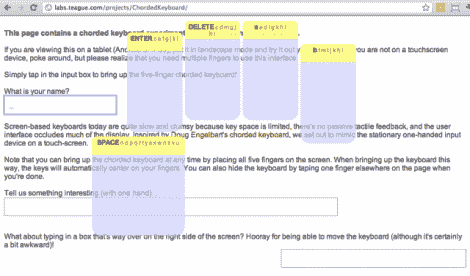

# 用于平板电脑的单手键盘

> 原文：<https://hackaday.com/2012/02/08/single-hand-keyboard-for-tablets/>

对我们来说，一只手拿着平板电脑，另一只手打字很有意义。这正是[Adam Kumpf]如何实现这个单手打字界面的，这个界面最初是由[Doug Engelbart]构思的。

如你所见，你右手的每个手指都有一个大的上下文区域。字母和导航键击通过该界面基于单次触摸或所有五个数字的组合来输入。这提供了 32 种可能的组合(包括全开和全关)，足以涵盖现代英语字母表。

[Adam 的] [演示页面适用于大多数平板电脑](http://labs.teague.com/projects/ChordedKeyboard/)所以试一试吧。是的，它也适用于 iDevices，这很令人惊讶，因为我们本以为它使用的是 Flash。如果你不在触敏设备附近，你可以从休息后嵌入的演示视频中了解操作要点。

现在，谁会是第一个在 iOS 5 上把这个做成替代键盘的人呢？

【维梅奥 http://vimeo.com/36395895 w = 470】