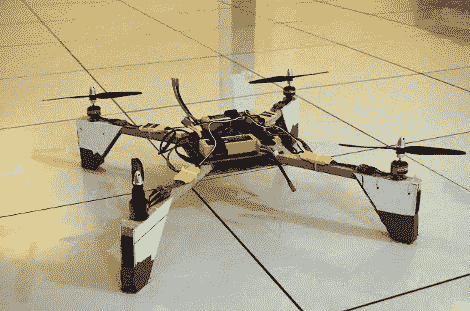

# 四轴飞行器为首次飞行做好准备

> 原文：<https://hackaday.com/2012/02/08/quadcopter-build-ready-for-first-flight/>

[Abhimanyu Kumar]一直在努力工作，建造并发布他的四轴飞行器。到目前为止，他已经为这个版本出版了 10 期，让我们身临其境地重温这次冒险。但我们真正感到兴奋的是 11 号，因为他计划在那部电影中分享第一个自由飞行的镜头。

在听说四轴飞行器被用来拍摄《蜘蛛侠 2》中的一些镜头后，这个 bug 就被植入了他的大脑。他想要一个属于自己的房子，但是现成房子的价格超出了他的能力范围。所以他决定建一个。第一个版本使用铝支架的交叉弥补电机安装。他添加了发光二极管来活跃气氛，甚至制作了一个绑在桌子上的演示视频(还没有 IMU，所以自由飞行是致命的)。在这个垫脚石之后，他决定用 Wii Motion Plus 和 Wii Nunchuck 作为定位反馈传感器。还有一个身体重新设计，有助于减轻负荷。

这是一个有趣的项目，我们迫不及待地想看看他从这里走向何方！