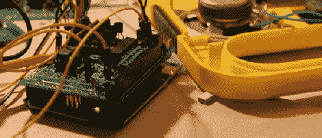

# MIDI 控制的朗读和拼写

> 原文：<https://hackaday.com/2012/02/09/midi-controlled-speak-and-spell/>

我们都爱 Arduino，但是 Arduino 会爱我们吗？曾经有一段时间，Arduino 无法表达它最深处的情感，但现在[Nick]从“说 T2”咒语中连接了一个[语音合成芯片](http://noizeinabox.blogspot.com/2012/02/arduino-speak-and-sell-midi-interface.html)，它终于可以对我们耳语一些甜言蜜语了。

最初的 20 世纪 80 年代 Speak & Spell 包含一个来自德州仪器的惊人的高科技语音合成器。这种创新的芯片出现在[【斯蒂芬·霍金】的声音](http://en.wikipedia.org/wiki/DECtalk)之前，后来成为 80 年代微型电脑的众多语音插件的特色，如 Apple II、BBC Micro 和许多雅达利街机游戏。

[Nick]已经为他的 Speak & Spell 项目工作了几个月，他正在测试他制作的 PCB。他自己承认，将一个 Arduino 连接到一个 Speak &法术有点困难，但是他有一些锦囊妙计来[绕过硬件的限制](http://noizeinabox.blogspot.com/2011/10/autoshutdown.html)。[Nick]项目的最终目标是为 Arduino 开发一个 MIDI 可控的语音合成器。这在之前[就已经做过了，但是从来没有从一个逆向工程的说话&咒语中做过。](http://code.google.com/p/tinkerit/wiki/Cantarino)

休息之后，您可以查看[Nick]在连接 Speak & Spell 语音芯片方面的进展。还有工作要做，但还是很让人印象深刻。

<https://w.soundcloud.com/player/?url=http%3A%2F%2Fsoundcloud.com%2Fnoizeinabox%2Ftest-the-arduino-midi-speak-1&width=false&height=false&auto_play=false&hide_related=false&visual=false&show_comments=false&color=false&show_user=false&show_reposts=false>

</body> </html>