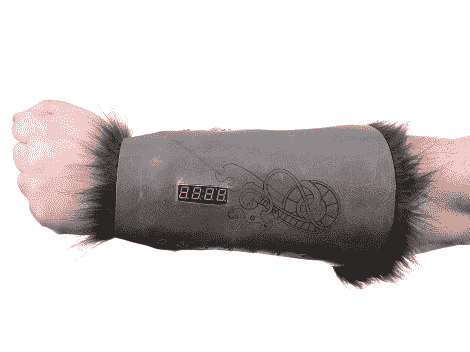

# 骰子挑战加入 D&D 游戏公司的角色扮演

> 原文：<https://hackaday.com/2012/02/09/dice-gauntlet-joins-cosplay-with-dd-gaming/>

如果你需要一个理由来为你的下一次龙与地下城冒险打扮，这肯定是它。这种吸引人的手腕装饰不仅会与你的中世纪主题相得益彰，而且[护手还可以兼做多面数字骰子](http://www.sparkfun.com/tutorials/333)。

Sparkfun 创建了这个详细介绍构建的教程。是的，他们在兜售他们自己的商品，但我们必须说这是少数几个使用可缝合电子产品的项目之一，我们非常喜欢。它需要几个 Lilypad 模块，包括 Arduino 板、加速度计和滑动开关。这些开关允许您选择要掷骰子的边数。当你前后晃动手腕时，加速度计就开始了乐趣(这是她说的)。该项目由可充电电池供电，这是我们一直喜欢看到的，并使用一个四位七段显示器，位于手表表面通常出现的位置。

当然，如果你愿意的话，你可以[获得震动效果，并且完全不用电池。](http://hackaday.com/2011/09/14/attiny-hacks-look-ma-no-batteries/)