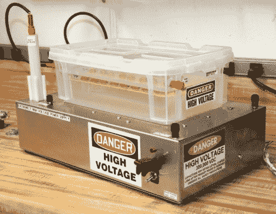

# Cockroft-Walton 倍增器可以输出正电压或负电压

> 原文：<https://hackaday.com/2012/02/10/cockroft-walton-multiplier-can-output-positive-or-negative-voltage/>

如果你已经尝试过高压电源，你可能会渴望更多的知识。这里有一个简洁的说明[如何构建一个可以输出正或负电源的电压倍增器](http://www.diyphysics.com/2012/02/09/d-i-y-250-kv-high-voltage-dc-power-supply-with-neat-trick-for-switching-polarity/)。它是基于一种被称为 Cockroft-Walton 乘法器的设计。这是上图中塑料盒中的附件。它使用二极管和电容器来产生高电压。事实上，同样的事情可以在那个[高压公告栏](http://hackaday.com/2011/11/10/20-kilovolts-replaces-push-pins-on-this-bulletin-board/)里找到。不同之处在于将乘法器连接到 PSU。

如果你仔细看，你可以看到一个红色和一个黑色的香蕉插头从塑料容器的末端伸出来。另一头也有一对这样的。乘法器的设计使得输入和输出的重新配置改变了它的工作方式。每个插孔都标有一个可能的输入和一个输出。选择所需的输出(DC+或 DC-)，然后按照其余连接的标签。

你能用这个装置做什么？看看休息后的剪辑，显示它为一个升降机提供动力。

[https://www.youtube.com/embed/p10OUADRr2M?version=3&rel=1&showsearch=0&showinfo=1&iv_load_policy=1&fs=1&hl=en-US&autohide=2&wmode=transparent](https://www.youtube.com/embed/p10OUADRr2M?version=3&rel=1&showsearch=0&showinfo=1&iv_load_policy=1&fs=1&hl=en-US&autohide=2&wmode=transparent)