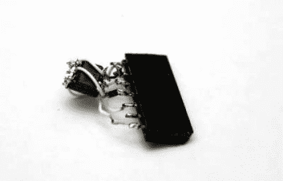

# JTAG 软件狗在启动后将代码推送到现场可编程门阵列

> 原文：<https://hackaday.com/2012/02/10/jtag-dongle-pushes-code-to-fpga-after-bootup/>

这种粗糙的野兽有着近乎魔法的特质。[Sprite_TM]将它拼凑成一个加密狗，连接到 JTAG 头上(尽管我们相当确定这不是该接口的标准尺寸)。他使用 [it 在设备启动](http://spritesmods.com/?art=stdalonejtag)后将代码推送到 FPGA。为什么？嗯，有几个原因，但最普遍的答案是，除非有一个信任链来验证将要运行的代码，否则一些主板不会启动。

在这种情况下，[Sprite_TM]使用的是他从中国供应商那里购买的仿制板。它是一个硬件网络终端(瘦客户端)，正如你在休息后的视频中看到的那样，它工作得很好。但那很无聊，他想把它用于自己的目的。当他插上加密狗并给主板加电时，网络终端不见了，取而代之的是玩吃豆人游戏的代码，就好像是一个完整的街机柜。

加密狗只是一个母 DIL 接头、一个 ATtiny85 和一个闪存芯片。AVR 有一个支持 XSVF 的软件 UART，该协议用于将数据推送到 FPGA。要写入的数据存储在存储芯片中，有了这个头部，重新编程 AVR 就只需连接一个 ISP 编程器。太棒了。

 <https://www.youtube.com/embed/s0boi8KJw6g?version=3&rel=1&showsearch=0&showinfo=1&iv_load_policy=1&fs=1&hl=en-US&autohide=2&wmode=transparent>

 </body> </html>