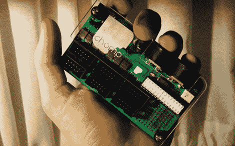

# 使用 Chomp 获得大量 MIDI 旋钮和按钮

> 原文：<https://hackaday.com/2012/02/11/get-tons-of-midi-knobs-and-buttons-with-the-chomp/>

虽然 MIDI 最初是为具有 64kb RAM 的 1 MHz 计算机设计的，但在推出近 30 年后，它仍然是一个行业标准。即使对于配备了微控制器的电子艺术家来说，如果你想将几个按钮连接到音乐工作站，MIDI 也是老掉牙的。但是，如果您想将几十个按钮和旋钮连接到一堆 MIDI 硬件上，会怎么样呢？进入 [Chomp](http://www.maxjusticz.com/introducing-the-chomp/) ，可配置硬件开源 MIDI 平台。

[Max Justicz]，一个我们听过的很棒的笔名，制造了一个 MIDI 控制器，允许 48 个按钮、旋钮和任何其他可以想象的电气连接的输入。该板由 Arduino-fied ATMega328 供电，并通过 2×5 带状电缆连接到您的传感器。

如果你曾经考虑过建造一个单体 MIDI 控制器，【Max Justicz】已经开始了一个 [Kickstarter 活动](http://www.kickstarter.com/projects/247030529/chomp-the-affordable-open-source-midi-controller)，将数百个 Chomps 放入野外。这似乎是一个伟大的方式[建立一些控制器](http://hackaday.com/2012/01/25/modular-controllers-you-cant-wait-to-show-off-to-your-friends/)或简单地发送东西给 MaxMSP。不管怎样，Chomp 肯定是有用的。