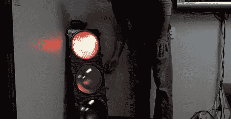

# 监控软件与交通灯一起构建

> 原文：<https://hackaday.com/2012/02/12/monitoring-software-builds-with-a-traffic-light/>

isotope11 的[JD]正在寻找一种方法，以便每当开发人员破坏他们正在开发的软件时，能够获得即时反馈。在找到一个 48 英寸高的交通灯后，他知道他必须做什么。现在，整个开发团队通过挂在角落里的红绿灯知道他们代码的状态。

isotope11 运行一个持续集成服务器来保证他们软件项目的质量。它比我们习惯的“编译和祈祷”设置灵活得多，但是 C 并不非常适合测试驱动的开发。当[JD]的一名开发人员破解了一段代码时，CI 服务器会向一个 Arduino 发送警告，所有的电子魔法都在那里发生。

为了点亮交通灯，[JD]使用了几个继电器来驱动交通灯中的 120 伏灯泡。交通灯非常容易辨认——红色表示有问题，绿色表示一切正常，黄色表示测试套件正在运行。

休息之后，请查看[JD]的 TDD 可视化视频。

[https://www.youtube.com/embed/3T5fEV5YHYo?version=3&rel=1&showsearch=0&showinfo=1&iv_load_policy=1&fs=1&hl=en-US&autohide=2&wmode=transparent](https://www.youtube.com/embed/3T5fEV5YHYo?version=3&rel=1&showsearch=0&showinfo=1&iv_load_policy=1&fs=1&hl=en-US&autohide=2&wmode=transparent)