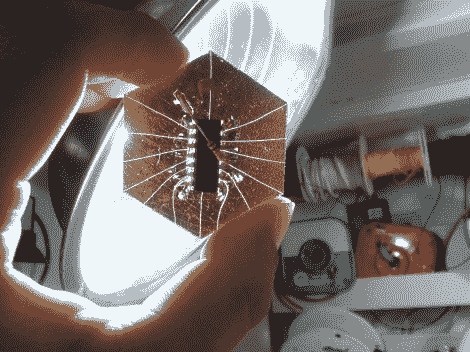

# 金箔电路板

> 原文：<https://hackaday.com/2012/02/13/gold-leaf-circuit-board/>

啊，金子的闪光…或者假金子，我们真的不确定。但是[迈克·霍根]和[PJ·桑托罗]一直在用人造金箔作为电路板上的导体。你在上面看到的设备被安装在金属覆盖的纸质衬底上，它真的工作。

他们开始在厚纸上喷涂粘合剂来制作他们需要的镀金。为了向费城的黑客空间 Hive76 致敬，它被剪成了六边形。从那里的形状的微控制器(一个 MSP430 G2211 在这种情况下)，以防止短路下的芯片。引线被弄平，以便与金触点很好地对接，并且使用业余爱好刀来刻划迹线。一些仔细的焊接完成了最后的连接，它们开始工作了。

哦，等等；板上有芯片，但芯片上什么也没有。他们忘记先编程了！由于没有接头，他们需要一种简单的方式与电路板连接。这些聪明的家伙利用磁铁的力量来固定鳄鱼夹。休息之后看看他们是如何做到的。

他们也在研究一些使用导电墨水的电路板[类似于这个黑客](http://hackaday.com/2011/06/30/new-conductive-ink-allows-circuit-prototyping-with-a-pen-and-paper/)但是我们还没有看到这两个关于这些实验的报道……

[https://www.youtube.com/embed/QFBg8Wii8r0?version=3&rel=1&showsearch=0&showinfo=1&iv_load_policy=1&fs=1&hl=en-US&autohide=2&wmode=transparent](https://www.youtube.com/embed/QFBg8Wii8r0?version=3&rel=1&showsearch=0&showinfo=1&iv_load_policy=1&fs=1&hl=en-US&autohide=2&wmode=transparent)