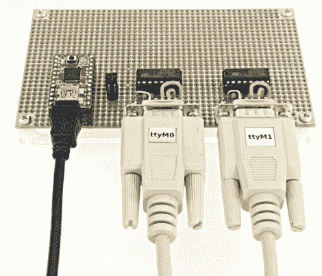

# AltSoftSerial 希望加速 Arduino 软件 UART

> 原文：<https://hackaday.com/2012/02/13/altsoftserial-looks-to-speed-up-arduino-software-uart/>

假设你在项目中使用了 Arduino。项目的一部分已经有了基于硬件的串行接口，需要第二个串行端口用于不相关的硬件。显而易见的解决方案是用软件编写一个。但是这是一个在 Arduino 环境中工作非常危险的地方。因为在代码和硬件中断之间有一个抽象层，所以很难知道你是否会遇到时间问题。但是有一个新的库可以使用，它试图减少基于软件的串行通信的延迟，所以你不必担心。

它之所以被命名为 AltSoftSerial，是因为它是一个基于软件的串行库，是新的 SoftSerial 包的替代产品。前者只有 2-3 微秒的延迟，而后者有多达 174 微秒的命中。如果它像宣传的那样起作用，那是一个很大的进步。搭建一个硬件测试平台并不难，示例程序只有十几行代码(这是在这种环境下工作的美妙之处),所以如果您有空的话，不妨试一试。