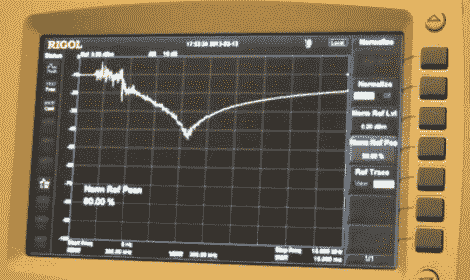

# 无源滤波器，数据传输和均衡。

> 原文：<https://hackaday.com/2012/02/13/passive-filters-data-transmission-and-equalization-oh-my/>

[Shahriar]带着新的“信号路径”视频回来了。已经过去几个月了，但没关系，因为他的视频总是充满了有用的信息。一些新设备已经被添加到他的实验室，作为一个额外的奖励，一个快速参观设备是包括在开始，这是伟大的，如果你喜欢对甜蜜的机器流口水。

[视频的真正焦点是高速数据通信，](http://thesignalpath.com/blogs/2012/02/13/tutorial-on-passive-filters-data-transmission-and-equalization/)达到每秒 GHz 的范围。[Shahriar]涵盖了从简单的 RC 低通滤波器到非常复杂的微波滤波器的滤波技术。解释 1.5Gbps 信号通过低带宽信道的频域和时域测量。他还展示了如何利用均衡来克服低带宽限制。

这是一个小时长的视频节目，里面充满了信息，所以你可能想在进去之前留出一些时间并准备一支铅笔。这是非常值得的，所以休息后加入我们。

[http://www.youtube.com/watch?v=MhWyAL2hKlk&w=470]