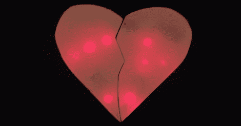

# 与你的情人分享一颗发光的 LED 心

> 原文：<https://hackaday.com/2012/02/14/share-a-light-up-led-heart-with-your-valentine/>

这不是玫瑰或珠宝，但我们希望[Erik]的[发光 USB 心脏](https://sites.google.com/site/geeksbuildstuff/usb-heart)会被他的另一半欣赏。当两个心形图案相互接触时，每一面都会发光。

[Erik]从聚碳酸酯上切下两个半心形的小块开始建造。在为发光二极管和电线钻了几个孔后，磁铁和簧片开关被安装在心脏“破损”的一侧。每当心脏彼此接触时，磁铁就会触动簧片开关，照亮心脏的两侧。

每个心形半体内都嵌有 u 盘，装有一个[便携式收纳盒](http://nionsoftware.com/dbpahk/)。当 USB 驱动器插入电脑时，dropbox 就会开始工作，并同步存储在每个心形图案中的相册。无论他们相距多远，[埃里克]和他的 SO 可以通过他们发光的 LED 心脏分享照片。不要表现得毫无希望的浪漫，但这听起来像是我们想要的情人节礼物。我们希望[埃里克]也是这么想的。