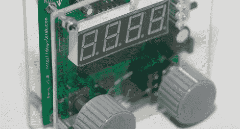

# 用相机声音触发器拍一张爆炸的照片

> 原文：<https://hackaday.com/2012/02/14/take-a-picture-of-a-bang-with-a-camera-sound-trigger/>

多年来，我们已经推出了数十款数码相机触发器。我们很少遇到像[Viktor]的[lil bang sound trigger](http://diy.viktak.com/2012/02/lil-bang-sound-trigger-for-cameras.html)这样设计精良的产品，每当麦克风接收到一个巨大的噪音时，它就会抓拍一张照片。

[Viktor]的构建基于 PIC16F 微控制器，其 LM386 放大器连接到麦克风。在设备的正面，右旋钮控制麦克风的灵敏度，左旋钮设置检测和触发之间的延迟。

lil bang 触发器通过一个光隔离的 3.5 毫米插孔连接到相机，该插孔兼容所有花哨的佳能和尼康数码单反相机。声音检测之间的延迟可以在 0 到 255 毫秒之间变化，允许对高速摄影装置进行精确控制。

所有这些工作都是在为拍摄闪电照片而制造的光敏触发器之后完成的。声控版不能用于闪电照片，但他认为它可以用于[碰撞](http://www.diyphotography.net/creating-the-splash)或[爆炸](http://www.flickr.com/photos/28028849@N02/2812713225/)的摄影研究。休息之后，请观看[Viktor]的《lil Bang》视频。

[https://www.youtube.com/embed/zT6ORMj7yhc?version=3&rel=1&showsearch=0&showinfo=1&iv_load_policy=1&fs=1&hl=en-US&autohide=2&wmode=transparent](https://www.youtube.com/embed/zT6ORMj7yhc?version=3&rel=1&showsearch=0&showinfo=1&iv_load_policy=1&fs=1&hl=en-US&autohide=2&wmode=transparent)