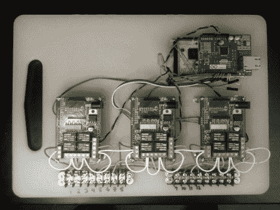

# Arduino 草坪护理是网络控制的

> 原文：<https://hackaday.com/2012/02/14/arduino-lawn-care-is-web-controlled/>

[Joe Fernandez]对这个爱好的硬件方面是相当新的，但是他似乎很容易就在这个项目上找到了自己的方式。他想为他的托罗草坪洒水系统建造自己的网络桥。他很有型地完成了它，并在休息后的视频中展示了他的成果。

他从一个安卓 ADK 开始，精心制作了一些网络魔术，使用 REST 接口和 JSON 包作为通信方案。这使得只要您有互联网连接，就可以从任何地方控制系统。随着他的需求变得清晰，硬件的其余部分也在发展。第一大块是添加一个以太网屏蔽，这样他就不需要将他的 Android 手机连接到系统上就可以工作。从那里，他需要控制系统上的电磁阀，并为此从 Seeed 工作室抓了三个继电器护罩。

如你所见，所有的硬件都在聚乙烯切菜板上有一个家。底部的端子板保持连接美观整洁，因为它们与喷水灭火系统连接。我们很高兴听到股票控制器仍然工作，这个附加组件不会以任何方式永久改变它。如果他想卖掉房子，这一点很重要。

还在使用传统的洒水装置而不是地下系统吗？也许[这个可变范围黑客是给你的](http://hackaday.com/2009/09/04/variable-range-sprinkler/)。