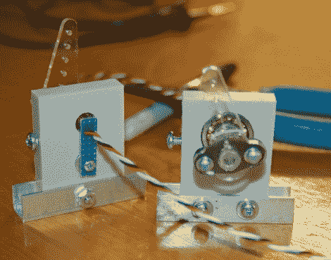

# 利用霍尔效应传感器改善您的飞行模拟体验

> 原文：<https://hackaday.com/2012/02/14/improving-your-flight-sim-experience-with-hall-effect-sensors/>

[Gene Buckle]为自己建造了一个漂亮的定制驾驶舱，用于玩飞行模拟器，但在使用过程中，他发现他为俯仰和滚动控制[建造的万向节几乎无法使用。](http://www.simpits.org/geneb/?s=109)他将问题缩小到他用来读取控制角度的电位计，因此他开始寻找合适且更稳定的替代品。

他认为霍尔效应传感器非常适合这项工作，所以他拿起一对 Allegro 1302 传感器，开始制造他的新控制输入。他将一支笔的一小部分安装到一个轴承中，用作输入轴，并在两端附上一个小的钕磁铁。因为他想用这些来代替罐子，所以在把它们安装到驾驶舱之前，他必须制造一套控制臂来安装在笔段上。

一切就绪后，他启动电脑，启动 Windows 操纵杆校准工具。他的基于电位计的控制过去在中心显示+/- 200-400 的恒定抖动，但现在实用程序显示稳定的“0”。我们认为这是一个相当好的结果！

[谢谢，基思]