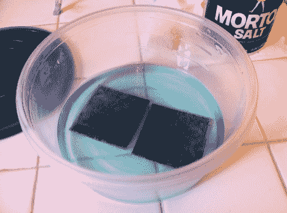

# 用醋蚀刻多氯联苯

> 原文：<https://hackaday.com/2012/02/15/etching-pcbs-with-vinegar/>

当我们在家里听到蚀刻 PCB 时，我们认为氯化铁或氯化铜被用来从电路板上腐蚀掉未掩蔽的铜。但是[Quinn Dunki]刚刚写了[她的 PCB 蚀刻指南](http://quinndunki.com/blondihacks/?p=835),她没有使用这两个。相反，她将醋、过氧化氢和盐混合在一起。醋比盐酸更容易找到([氯化铜是用这个，过氧化氢，并加入铜制成的](http://hackaday.com/2008/07/28/how-to-etch-a-single-sided-pcb/))，所以如果你在紧要关头(或在 Macgyver 的情况下)，这是要记住的事情。

剩下的过程是我们所熟悉的。她正在使用可以用一张透明片遮盖的光敏板，而不是使用墨粉转移法。一旦他们在显影液中洗了澡，她就把他们放在一个盛有醋和过氧化氢以及一茶匙盐的浅盘中。她大约每隔一分钟就用泡沫刷擦拭表面，每隔十分钟检查一次，看看它们是否完成了。

她确实讨论过如何处理。似乎每次用完之后她都会把溶液扔进垃圾箱。这种液体将含有对野生动物有害的铜盐。我们听说你应该中和酸，用这种液体做一块混凝土，然后把它扔进垃圾箱。有没有人有一个经过充分研究的、合乎道德的、环保的方法来处理掉这些东西？