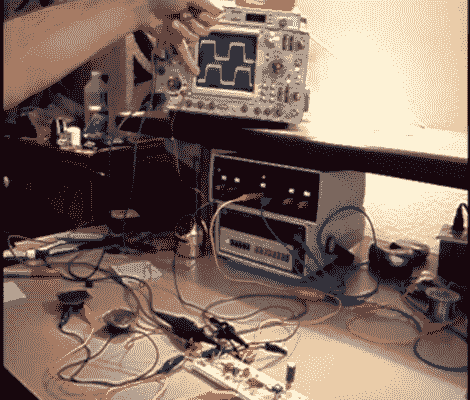

# 锁相环介绍

> 原文：<https://hackaday.com/2012/02/15/intro-to-phase-locked-loops/>

[Kenneth Finnegan]发表了一篇关于 PLL(锁相环)的长篇初级读本。我们真的很喜欢他的演讲(甚至是他为了免费的示波器而迎合 Rigol 的那部分…也给我们报名吧)。PLL 背后的概念并不难理解，[Kenneth]设法提供了一些不同的演示，确实有助于深入理解每一点。

PLL 由三部分组成:鉴相器、低通滤波器和压控振荡器。它可以做非常漂亮的事情，比如提高时钟速度(你可以在更强大的芯片中看到它们，比如 ARM 架构)。视频中的实验使用 CD4046 芯片，该芯片有两种不同类型的鉴相器。上面示波器上显示的两个信号将输入的时钟信号与 VCO 的输出进行比较。根据所用鉴相器的类型和低通滤波器的质量，它们可能是紧密同步的，也可能是极不稳定的。通过观看休息后嵌入的视频找出原因。

 <https://www.youtube.com/embed/0jzLDe950AY?version=3&rel=1&showsearch=0&showinfo=1&iv_load_policy=1&fs=1&hl=en-US&autohide=2&wmode=transparent>

 </body> </html>