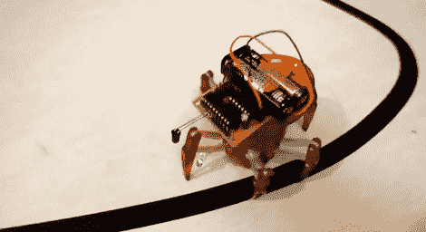

# Hexbug 代码重写使它成为一个行走的行追随者

> 原文：<https://hackaday.com/2012/02/15/hexbug-code-rewrite-makes-it-a-walking-line-follower/>

如果您可以通过代码重写轻松地重新调整它的用途，您就知道您已经获得了一个好的硬件平台。这就是[埃里克]继续用这些小六角虫做的事情。这一次，他将红外发射器和接收器向下弯曲，用作反射传感器。这个[赋予了它在光亮表面上跟随暗线](http://buildsmartrobots.ning.com/profiles/blogs/hacking-the-hexbug-tm-spider-with-the-emgrobotics-msp430g2553rcb-)的能力。

他最初将一个 MSP430 修补到 25 美元的遥控玩具中。红外对是为了避免障碍，[，我们在最近的链接帖子](http://hackaday.com/2012/02/08/hackaday-links-february-8-2012/)中看到。这个黑客做了一个伟大的工作，重新利用回避系统。由于附加硬件安装在电动转塔上，单个传感器对可以来回扫描，以找到它将跟随的线。在某种程度上，这比大多数使用安装在车身上的多个传感器的线跟随器要好。但缺点是这会导致旅行变慢，而且[不会赢得任何比赛](http://hackaday.com/2010/08/13/a-collection-of-quick-line-followers/)。休息之后不要错过演示片段。

 <https://www.youtube.com/embed/sA1hMtLhBdQ?version=3&rel=1&showsearch=0&showinfo=1&iv_load_policy=1&fs=1&hl=en-US&autohide=2&wmode=transparent>

 </body> </html>