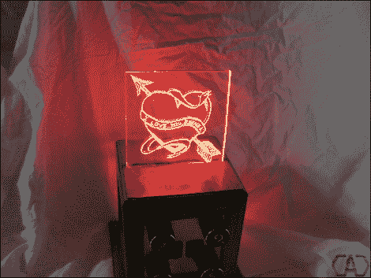

# 这份热情洋溢的情人节礼物倾注了大量的爱

> 原文：<https://hackaday.com/2012/02/15/a-lot-of-love-went-into-this-glowing-valentine/>

[威尔]没有像大多数男人一样在情人节那天买卡片、玫瑰和葡萄酒。不，他提前计划好了，然后[做了这个颜色可选的发光情人节礼物](http://computersandcircuits.com/?q=vday_led_mixer)。当我们第一次看到它时，我们认为他把一些发光二极管和一个微控制器放在一起，并用一块丙烯酸材料做边缘照明。虽然这是技术上发生的事情，但这里有比你想象的更多的设计和工艺。

首先，控制器板是一个设计精美的双面 PCB，他蚀刻而成，而不是将一堆电线和热熔胶扔进外壳。说到外壳，他从大盒子商店里拿了一个木制的图片盒，并用一块黄铜板材作为控制面板。在顶部为丙烯酸树脂增加一个狭缝后，外壳用有色聚氨酯完成。信息本身是用雕刻钻头和 Dremel 工具磨出来的。这是手工完成的，我们认为最终的外观可以与我们过去看到的 CNC 铣削饰品相媲美。

好好看看这个设备，并在跳跃后的剪辑中演示它的功能。

 <https://www.youtube.com/embed/G8bdi8ok_N4?version=3&rel=1&showsearch=0&showinfo=1&iv_load_policy=1&fs=1&hl=en-US&autohide=2&wmode=transparent>

 </body> </html>