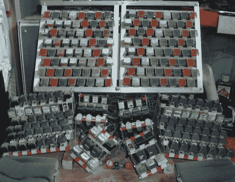

# 微型开关键盘让那些懒惰的拇指得到锻炼

> 原文：<https://hackaday.com/2012/02/16/microswitch-keyboard-gives-those-lazy-thumbs-a-workout/>

乍一看，任何人都不会怀疑[这是一个黑客的键盘](http://mykeyboard.co.uk/microswitch/)。几年前，蒂姆·泰勒(Tim Tyler)以改善人机界面为目标，建立了这个看起来很奇怪的按键集合体。当你每个拇指至少有九个键时，为什么要用一个长键盘浪费所有的拇指空间呢？

经过一些额外的考虑，这并不都是非正统的。我们见过分开双手的键盘；事实上，你可以买到它们。这只是增加了拇指矩阵和字母数字部分上方的可编程键架。它的多重等级很像风琴，你不觉得吗？休息后请观看演示视频。它当然有完全属于它自己的击键声。这种声音不同于 clack ity“M”键盘及其现代同类产品，这要归功于构成每个按键的微型开关。

如果你觉得另一个临时搭建的键盘对你的口味来说太普通了，这可能是个不错的选择。【T2[https://www.youtube.com/embed/9yg3s77nAMQ?version=3&rel=1&showsearch=0&showinfo=1&iv_load_policy=1&fs=1&hl=en-US&autohide=2&wmode=transparent](https://www.youtube.com/embed/9yg3s77nAMQ?version=3&rel=1&showsearch=0&showinfo=1&iv_load_policy=1&fs=1&hl=en-US&autohide=2&wmode=transparent)

[谢谢 Geekabit]