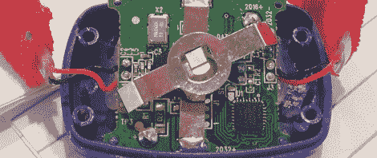

# 问 Hackaday:你看了格莱美吗？

> 原文：<https://hackaday.com/2012/02/19/ask-hackaday-did-you-catch-the-grammys/>

虽然颁奖典礼不一定是我们的事情，但[T. D.]送来了一些激起我们兴趣的东西。他的朋友们最近刚从格莱美颁奖典礼回来，他们在那里目睹了成千上万的 LED 手镯随着酷玩乐队的表演而闪烁。一点点 YouTubing 调出了[这个演示效果的视频](http://www.youtube.com/watch?v=f_SQ7lJrp1E&t=1m55s)(因为那个视频很可能很快就会被撤下，就从[这个链接](http://www.youtube.com/results?search_query=coldplay+grammys+2012&oq=coldplay+grammys+2012)里选点东西)。

[T.D.]的朋友带回来一个这样的手镯，像一个好的黑客读者一样，他把它打开了。[这个](http://hackaday.com/wp-content/uploads/2012/02/2012-02-14-13-54-49.jpg)就是【T.D .】发过来的珍贵板子 pic。我们很有信心 IC 是一个 [ATMega48PA](http://www.atmel.com/devices/ATMEGA48PA.aspx) ，但除此之外，我们不太确定这些手镯如何能够像【T.D .】所说的那样“在准确的时间点亮和闪烁”。

从格莱美的广播中我们看到，有可能这些手镯只是在用户拍手的时候闪烁。这么简单的电路不需要微控制器，所以我们想知道这里到底发生了什么。如果你知道这些精心设计的发光手镯是如何工作的，请在评论中留言。

编辑:评论者指出，这些腕带被称为“[木带](http://www.coldplay.com/newsdetail.php?id=906)”在 2011 年 X Factor 总决赛上，有一个关于这些腕带的[视频](http://www.youtube.com/watch?v=lFHm7cjECsQ)。