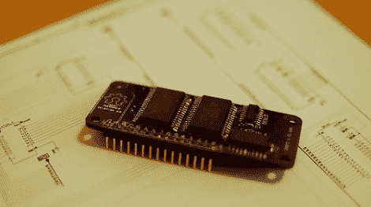

# 512k SRAM 板，用于您的下一次原型制作

> 原文：<https://hackaday.com/2012/02/20/512k-sram-board-for-your-next-prototyping-run/>

发现您的内存不足，并支付更昂贵的芯片只是为了填补这一功能缺口？由于片上硬件特性，许多高端芯片都可以选择添加 SRAM，但如果您没有这个【512k SRAM 附加板可以用于任何具有 13 个额外 I/O 引脚的芯片。

如果您通常使用低引脚数的芯片，那么引脚的使用听起来可能会有缺陷。但由于内存芯片的写保护状态选项，这 13 个引脚中的 9 个可以在不读取或写入内存时发挥双重作用。说到这里，地址方案被设计成以 32 位块来访问存储器，但是如果需要的话，单个字节也是可以访问的。[Wardy]一直在使用 75 MHz 的螺旋桨芯片测试他的设计，所以我们知道它是为速度而建的，但他也提到主板也没有最低时钟速度。他在分享他的工作时使用了开放硬件指南，如果你自己想要一个，你也可以给[他用于原型的呆子机器人 PDX 服务](http://dorkbotpdx.org/wiki/pcb_order)来获得你自己的主板。

[via [危险原型](http://dangerousprototypes.com/2012/02/16/open-source-512k-sram-memory-board/)