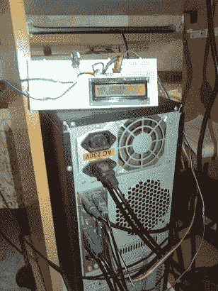

# 谁不能多利用一点屏幕空间呢？

> 原文：<https://hackaday.com/2012/02/21/who-couldnt-use-a-little-more-screen-space/>

文本液晶显示器在任何场合都很方便，你电脑上的打印机端口也很方便。混合在一起，添加一点 linux，你就可以得到一个非常方便的连接到并行端口的 16×2 LCD 的 Linux 设备驱动程序。

LCD 以典型的 4 位模式连接，这允许并行端口使用其 8 位数据寄存器写入数据，同时控制寄存器选择和使能引脚。下一步是为 linux 制作一个模块，对于这种类型的屏幕来说，这看起来很标准。

制作驱动程序，插入模块以便可以加载，添加节点以便您知道以后在哪里可以找到它，您只需“echo Hello > /dev/my_lcd”就可以为您的新外部显示器找到各种创造性的用途。