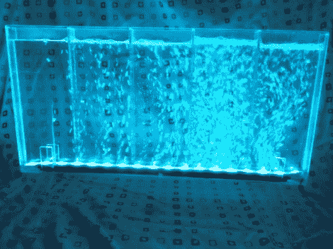

# 拼凑出一面变色水墙

> 原文：<https://hackaday.com/2012/02/21/hacking-together-a-color-changing-water-wall/>

[BadWolf 的]女朋友想让他为她做一盏圣诞灯，他没有让她失望。他想出的是[一个装满水的变色灯，灯上有气泡](http://badwolf.hackhut.com/2012/02/19/led-water-wall-ambient-light/)以增加趣味性。跳完之后在剪辑里自己看。

一些防水 RGB LED 灯条很容易改变颜色。[BadWolf]在这个项目中走了 Arduino 路线，但是任何微控制器都能够完成颜色循环的任务。外壳全部由亚克力板材手工制成。他从五金店抓起一些化学焊接液，用注射器涂在亚克力上。将边缘固定到外壳的一侧非常简单。但是当要封闭另一边的时候就变得更加困难了。他录制了一段视频，视频显示注射器被绑在一根杆上，这样他就可以把注射器放进去，用第二个延长装置推动活塞。

气泡由一个小型水族箱泵提供。我们想知道这是否需要经常清洗，或者你是否可以得到一些泳池化学品来保持它的清洁(或者仅仅一茶匙漂白剂)？ <https://www.youtube.com/embed/QdDXedjsyWg?version=3&rel=1&showsearch=0&showinfo=1&iv_load_policy=1&fs=1&hl=en-US&autohide=2&wmode=transparent>

 </body> </html>