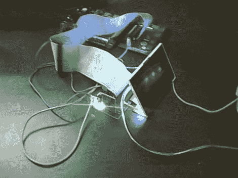

# 通过学习这款 LCD 控制原型，提升您的 FPGA 游戏性能

> 原文：<https://hackaday.com/2012/02/22/up-your-fpga-game-by-learning-from-this-lcd-control-prototype/>

[Cesar]最近用他的 FPGA 开发板安装并运行了 PSP 显示器。这是一个不错的项目，但我们真正喜欢的是他留出大量时间来展示如何完成每一步。这不仅仅是一个关于特定屏幕的教程，而是一个让任何硬件工作所需的技能的概述。

屏幕本身是夏普 LQ 043 T3 dx 02；480×272 TFT 显示屏，1600 万色。对你的项目来说还不错，但当你开始研究控制方案时，这不会像用 Arduino 使用诺基亚屏幕那样。控制它需要二十个针脚；红色、绿色和蓝色占用十六个管脚，四个管脚用于控制，其余的是 CK、DISP、Hsync、Vsync。

明智的是，[Cesar]设计了自己的接口板，其中包括带状电缆的连接器。它还具有屏幕背光的驱动程序，并为设备供电。硬件设置完成后，他开始钻研数据手册。他详细介绍了如何从该文档中获取您需要的信息，并展示了他将这些信息首先转化为流程图，然后转化为 FPGA 代码的方法，我们对此非常欣赏。