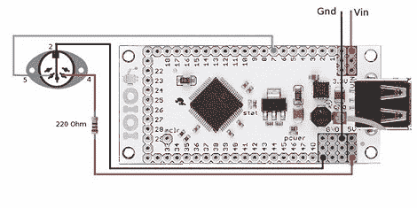

# 用 Android 设备控制 MIDI

> 原文：<https://hackaday.com/2012/02/23/control-midi-with-an-android-device/>

[Lewis]想用他的 Android 手机的巨大触摸屏来控制 MIDI 设备。在他找不到 MIDI out 的简单硬件实现后，他转向 IOIO 板[向几乎任何可以想象的音乐硬件发送 MIDI 音符](http://l-baker.com/?p=9)。这是一个干净的构建，填补了 Android 平台能力的空白。

由于 Android 对 MIDI 的支持很少，Lewis 找不到一个好方法将 MIDI 笔记从他的手机推送到其他设备上。虽然有一些高开销的选项，如 wi-fi 上的 MIDI 或[蓝牙连接](http://hackaday.com/2011/07/09/turn-any-bluetooth-device-into-a-midi-controller/)，但没有太多直接的硬件连接到其他 MIDI 设备。[Lewis]通过使用 [IOIO 板](http://www.sparkfun.com/products/10748)和合适的软件通过 DIN-5 连接器发送 MIDI 音符，绕过了这个限制。

虽然这个项目按预期工作，但通过构建这些 MIDI 接口中的一个并将其连接到 IOIO，可以使[Lewis]的构建更加持久。所有的 Android 代码都已经[发布并可用](https://bitbucket.org/LBNerdBard/android-midi-example/)，还有一个简洁的演示,【刘易斯】在他的吉他装置中控制一个效果单元的延迟时间。休息之后你可以看看那个视频。

 <https://www.youtube.com/embed/G6GEsmKtlPw?version=3&rel=1&showsearch=0&showinfo=1&iv_load_policy=1&fs=1&hl=en-US&autohide=2&wmode=transparent>

 </body> </html>