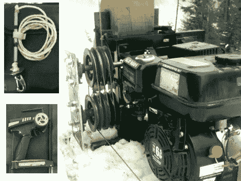

# 后院滑雪缆车

> 原文：<https://hackaday.com/2012/02/22/backyard-ski-lift/>

如果你在不列颠哥伦比亚省的山上拥有一间小屋，在温暖的夏季你会做什么？嗯，我们可能会混合鸡尾酒和吊床，但[达林]更有动力。他建造了自己的滑雪缆车，为下雪季节做准备。他在一个论坛帖子中分享了细节，但你必须注册并等待批准，然后才能[查看该主题](http://snowguns.com/eve/forums/a/tpc/f/2646033735/m/2227039406?f=2646033735&a=tpc&m=2227039406&s=4826057994)。也许你会想在做出承诺之前看看广告后的视频。通常我们会忽略需要登录才能查看的项目，但是这个项目值得关注。

该装置本质上是一个非常陡峭的拖绳。1600 英尺的 1/8 英寸飞机电缆覆盖了他 800 英尺的房产。显然他总共有 1000 英尺的垂直落差，但是电梯还没有完全覆盖整个区域。那台 6.5 马力的本田发动机驱动电缆回路，上面看到的滑轮系统用作 RPM 减速器。每个滑雪者都可以用尼龙绳、滑雪杖垫片和钩子钩住缆绳。遥控车辆遥控器就像一个安全开关，踩下油门时缓慢启动电梯，松开油门时停止电梯。

通常我们喜欢链接到类似的项目，但到目前为止，这是我们唯一的滑雪缆车。你将不得不满足于这个安装在滑雪杆上的视点显示器。

[https://www.youtube.com/embed/3yyXRBPijG0?version=3&rel=1&showsearch=0&showinfo=1&iv_load_policy=1&fs=1&hl=en-US&autohide=2&wmode=transparent](https://www.youtube.com/embed/3yyXRBPijG0?version=3&rel=1&showsearch=0&showinfo=1&iv_load_policy=1&fs=1&hl=en-US&autohide=2&wmode=transparent)