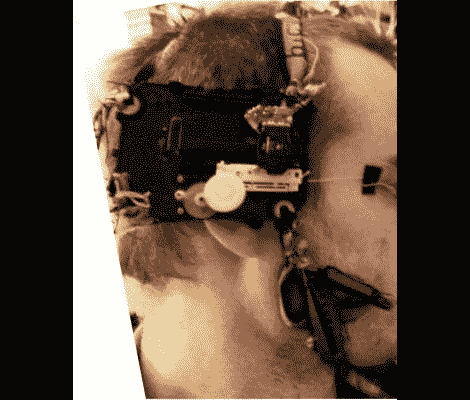

# 自动眯眼代替眼镜、隐形眼镜或 Lasik

> 原文：<https://hackaday.com/2012/02/22/automated-squinting-instead-of-glasses-contacts-or-lasik/>

[李]是近视眼，已经有了接触和眼镜。当试图找出一个替代方案时，他着眼于问题的核心。眼睛的形状不正确，因此不能充分聚焦。解决办法是改变镜片的形状。这正是 lasik(激光眼科手术)所做的，但不是在令人难以置信的明亮的手术刀下进行，而是[Lee]制作了一些[头盔，戴在你的脸上来重塑你的眼睛](http://www.instructables.com/id/Squintasaurus-cybernetic-dynamically-adjustable-v/)。

硬件来自一个旧的便携式 CD 播放器。移动激光镜头的雪橇已经被改变用途，用来拉动粘在他眼角皮肤上的一根线。他建立了一个控制系统，让他通过移动手指来调节张力。基本上，当皮肤被拉紧时，会导致他斜视，并可能使角膜稍微变形。我们不赞成这个想法，但我们不能放弃这个实验；谁知道这会导致什么发现呢？我们很高兴他没有用电脉冲来黑他的偷窥者。

休息后可以找到一些嵌入的测试视频。

 <https://www.youtube.com/embed/GSzQtOVbeJI?version=3&rel=1&showsearch=0&showinfo=1&iv_load_policy=1&fs=1&hl=en-US&autohide=2&wmode=transparent>

 </body> </html>