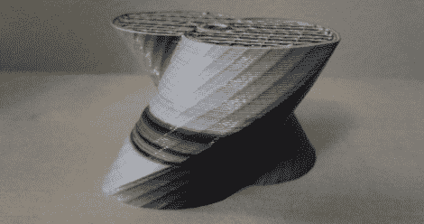

# 多色 RepRap 印刷真的真的很难

> 原文：<https://hackaday.com/2012/02/23/multicolor-reprap-prints-the-really-really-hard-way/>

[阿德里安·鲍耶]刚刚在 RepRap 博客上发布了他在多色印刷方面的进展。

新的发展是[Adrian]的实验的延续，该实验使用一种混合挤出机从同一个喷嘴喷出四种不同颜色的细丝。[Myles Corbett]接受了这个想法，并运用它制作了上面看到的双色印刷。为了从喷嘴中喷出两种不同颜色的细丝，[Myles]使用了两个[鲍登挤出机](http://reprap.org/wiki/Erik's_Bowden_Extruder)，它们安装在 RepRap 的顶点附近，带有通向喷嘴的管子。目前，印刷品的颜色是通过松开挤压机的夹紧螺钉来控制的，但有计划将这项任务转移到挤压机的电子控制上。

虽然现在可能只有黑色和白色，但一旦五台挤出机装满青色、品红色、黄色、黑色和白色细丝，这将是一个非常有趣的发展。是的，现在理论上可以在 RepRap 上打印全色 3D 对象。虽然我们并不期待将我们的单马达挤出机升级为四马达或五马达型号，但桌面制造的可能性正在变得令人惊叹。