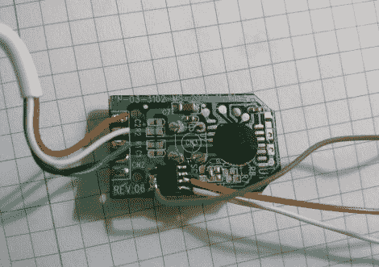

# 重新编程推广 USB 加密狗推出自定义网址

> 原文：<https://hackaday.com/2012/02/28/reprogramming-promotional-usb-dongles-to-launch-custom-urls/>

(Jjshortcut 的)学校的老师们每人都得到了一个网络密钥，作为某种形式的促销品，但大多数员工认为它们没用，所以就把它们扔了。[Jjshortcut]拿到了其中几个，决定拆开一个，看看是什么让它们滴答作响。

他发现这个设备非常简单，只需一个按钮就可以打开 Windows 运行提示符，输入一个 URL，然后启动 Internet Explorer。由于微控制器被锁在一滴环氧树脂下，他开始用他的总线盗版器在板载 EEPROM 周围打探，看是否能找到什么有趣的东西。原来他能够读取 EEPROM 的内容，由于它没有写保护，他可以用自己网站的 URL 替换标准的 URL。

虽然可以肯定地说，如果没有新的微控制器，Webkeys 可能无法用于比启动浏览器更令人兴奋的事情，[Jjshortcut]可以随时重新编程，并将它们放在随机的位置，为他的网站带来一些新的流量！

[谢谢，沃特]