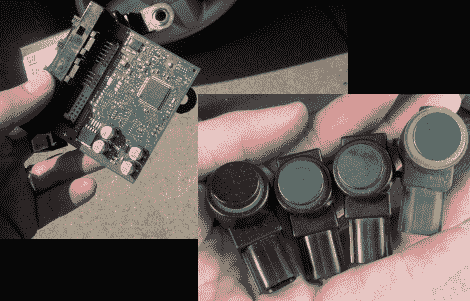

# 调查驻车辅助传感器

> 原文：<https://hackaday.com/2012/02/26/investigating-parking-assist-sensors/>

当他的妻子外出时，詹姆斯抓住机会用她的雪佛兰 Tahoe 的停车辅助传感器四处窥探。我们可以理解从某人的车里取出零件会让他们不太高兴。但我们觉得好笑的是，他正在摆弄的是一辆租赁的公司汽车。但我们很高兴他这么做了，他发表的关于这个项目的 10 页文章非常吸引人。

你可以看到乘客座位下面的控制板。它使用飞思卡尔微控制器来读取四个安装在保险杠上的超声波传感器。但是仅仅看使用了哪些部件显然不足以满足黑客的求知欲。[詹姆斯]破坏了一个 CAN 总线工具来嗅探数据包。这些传感器使用通用汽车公司设计的定制芯片，利用单线通信系统。他想出了通信方案，并构建了一个基于 mbed 的测试平台来直接读取它们。

[via [危险原型](http://dangerousprototypes.com/2012/02/22/reverse-engineering-car-parking-sensors/)