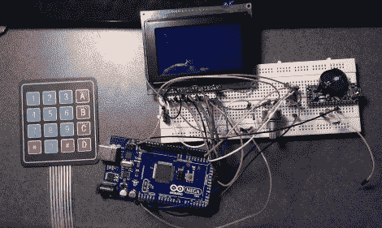

# 室友琐事的欠条管理

> 原文：<https://hackaday.com/2012/02/26/iou-management-for-roommate-chores/>

[克里斯]和另外五个人共用一间宿舍。当与他人一起生活时，保持清洁是很重要的，而且要做到公平。六胞胎想出了一个精心设计的家务白板。问题在于让每个人都及时做好自己的工作。为了促进这一点，[克里斯]想出了一个系统，让室友们交换家务，给彼此一张借条作为未来的责任。

该系统使用 Arduino 板和 RTC 芯片来精确计时。用户界面由一个图形 LCD 和一个键盘组成，所有东西都装在一个纸板盒里。[Chris]在休息后的视频中展示了他的系统，将大部分时间花在了债务系统上。室友们有一大笔钱用来购买集体杂货，这个系统会让你知道每个人的立场。但根据他的书面描述，这也存储了需要完成的家务日历，并允许你与他人交换，以适应你的个人时间表。

所以现在的问题是让每个人都使用这个系统。但是我们认为这不会太难，因为他们六个人都是计算机科学家。

 <https://www.youtube.com/embed/c43Rz-L-YEc?version=3&rel=1&showsearch=0&showinfo=1&iv_load_policy=1&fs=1&hl=en-US&autohide=2&wmode=transparent>

 </body> </html>