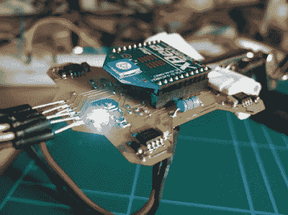

# 200 美元左右的 DIY 四轴飞行器

> 原文：<https://hackaday.com/2012/02/27/diy-quadcopter-for-around-200/>

我们认为[FlorianH]在廉价的上做了出色的[原型设计。总费用大约在 200 美元左右，我们对零件的质量和结果非常满意。](https://sites.google.com/site/fpgaandco/minima)

在这里，您可以看到他蚀刻的双面板的顶部，以容纳所有组件。在每个角落都有一个驱动电机的功率 MOSFET。乍一看，我们认为 Xbee 模块也充当无线电控制和处理器。但在底部，你会发现一个 ATmega32，它负责读取陀螺仪传感器和加速度计，处理这些信号，并通过 PWM 线路驱动每个 MOSFET，以提供稳定性。

休息之后你可以看到一些飞行测试。[FlorianH]提到，当同时使用陀螺仪和加速度计时，反馈环路中会有一些振荡。但是把加速度计从等式中去掉，平台就坚如磐石了。

这种构建使用碳管来安装电机，我们认为这将比全 PCB 设计的更加坚固。

 <https://www.youtube.com/embed/s5ALTDcdjEM?version=3&rel=1&showsearch=0&showinfo=1&iv_load_policy=1&fs=1&hl=en-US&autohide=2&wmode=transparent>

 </body> </html>