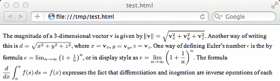

# 最后，HTML 文件中的 LaTeX

> 原文：<https://hackaday.com/2012/02/27/finally-latex-in-html-files/>

用 LaTeX 写论文总会产生漂亮的输出，但如果你想把文档放到网上，你只能有两个合理的选择:以. PDF 格式提供文档(虽然有些可怕，但 Chrome 让事情变得更容易接受)，或者依赖像 TeX The World 这样的第三方浏览器插件。现在[托德·雷曼]终于[编写了一个 perl 脚本](http://tex.stackexchange.com/questions/44486/pixel-perfect-vertical-alignment-of-image-rendered-tex-snippets/45621#45621)来将 LaTeX 嵌入 HTML 文档，没有理由再键入 e^i*pi + 1 = 0 了。

对于那些不了解的人来说，LaTeX 是一种文档排版语言，可以产生[漂亮的输出](http://en.wikipedia.org/wiki/LaTeX#Examples)，通常是 PDF 格式。不幸的是，当[蒂姆·伯纳斯·李]发明 HTML 时，他决定推出自己的标记语言，而不是简单地从[唐·克努特]那里剽窃。从那时起，乳胶爱好者不得不将 TeX 片段作为图像放入网页，或者依赖于[；\乳胶；]生成自 [TeX The World](http://thewe.net/tex/) 浏览器扩展。

[Todd Lehman]的 perl 脚本生成了他的 LaTeX 文件的 PDF，并将所有奇怪的字体和数学符号提取到 PNG 文件中。这些 PNG 文件被小心地嵌入到从 LaTeX 文件中提取的普通文本生成的 HTML 文件中。让这些文档系统正常工作需要做大量的工作，但至少现在有一种合理的方式将好看的 LaTeX 放到网上。