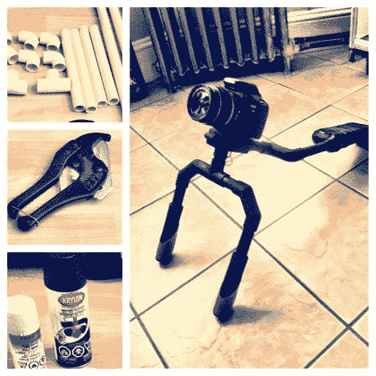

# 适用于任何相机的肩部支架

> 原文：<https://hackaday.com/2012/02/28/shoulder-mount-for-any-camera/>

不管你的原因是什么，如果你要长时间拿着相机，这个肩架既能稳定图像，又能帮你省掉一些疼痛。[Kyle Jason]按照这个指南建造了上图[中的钻机，只花了 20 美元。](http://www.instructables.com/id/PVC-Camera-Shoulder-Rig-Filmmaking/)

[Knoptop]大约一年前出版了该指南。它没有使用任何特殊的 PVC 连接器，所以你可以在五金店找到你需要的任何东西。使用的连接器包括 45 度和 90 度角、直件和一个用作安装支架的 PVC 导管盒。在切割、干装配和焊接之后，钻机真的受益于几层油漆。不要忘了把手套，这样可以方便抓握。

不想看构建指南？休息之后，你会发现[Knoptop 的]构建视频，这实际上是一个相当有趣的八分钟观看。

 <https://www.youtube.com/embed/sa7eeZgqRas?version=3&rel=1&showsearch=0&showinfo=1&iv_load_policy=1&fs=1&hl=en-US&autohide=2&wmode=transparent>

 
[via <a href="http://www.reddit.com/r/DIY/comments/q6way/20_dslr_shoulder_mount/" target="_blank"> Reddit </a>
 </body> </html>