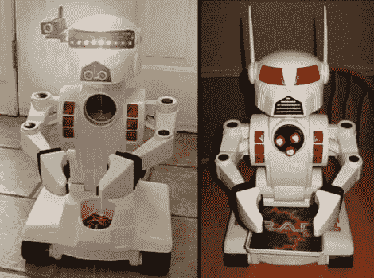

# 15 美元的玩具变成完全可编程的机器人

> 原文：<https://hackaday.com/2012/02/28/15-toy-becomes-fully-programmable-robot/>

[Kevin]建造机器人部分是为了他自己的享受，但也包括他的孩子。他买了一个便宜的玩具，并在里面装满了可编程的好东西。起点是一个名为 Rad 2.0 的 15 美元的玩具。这是一个很好的起点，因为它已经包括了一些机动部件，并解决了许多机械问题，如关节和结构。

左边的图片是[Kevin]发布的第四次更新。机器人现在对语音命令做出反应(与 Chippu 使用的语法相同)，将目光转向前方或两侧。你会注意到有一个无线网络摄像头，让他可以监视机器人视线前方的情况。一个超声波测距仪在机器人的喙中安家，一个拉森扫描仪安坐在眉毛上[使用邪恶疯狂科学家实验室](http://hackaday.com/2010/10/14/larson-scanner-hacking/)的套件。休息之后，请观看视频，了解硬件修改的概述。

这个项目的构建日志是一个论坛帖子。这个论坛是由[DJ Sures]经营的，他是一个在[把廉价玩具做得很棒的老手。看起来他已经开了一个网络论坛，而且做得很棒，因为关于[Kevin 的]项目的讨论充满了建设性的建议和鼓励。](http://hackaday.com/2011/12/08/dj-sures-digs-up-another-80s-robot-toy-makes-it-awesome/)

[https://www.youtube.com/embed/YZjXYblhqAI?version=3&rel=1&showsearch=0&showinfo=1&iv_load_policy=1&fs=1&hl=en-US&autohide=2&wmode=transparent](https://www.youtube.com/embed/YZjXYblhqAI?version=3&rel=1&showsearch=0&showinfo=1&iv_load_policy=1&fs=1&hl=en-US&autohide=2&wmode=transparent)

[谢谢 DJ Sures]