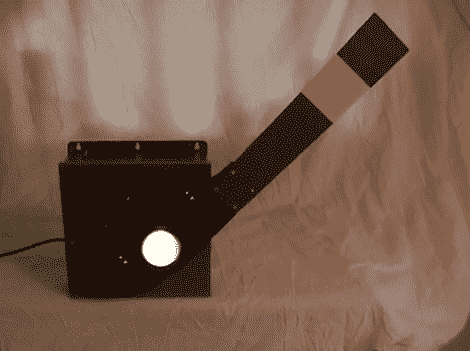

# 旗语信号副本完美的火车迷在你的生活中

> 原文：<https://hackaday.com/2012/02/29/semaphore-signal-replica-perfect-for-the-train-buff-in-your-life/>

[John Philip 的]哥哥为他的铁路模型设置留出了一个相当大的房间，他正在寻找一些有趣的东西添加到他哥哥的收藏中。他没有为铁路本身建造什么东西，而是决定用一个 1900 年代早期风格的旗语铁路信号作为房间里的新奇物品。

这个项目从[约翰]在互联网上搜寻彩色信号透镜开始。一旦他找到一套适合他的，他就处理一些数字，以确保信号盒的其余部分保持原来的规模。在信号灯的盒子里，你会发现一个用于他的光源的小型调节板、一个 Arduino 和一个用于驱动手臂的电机控制板。

为了确保信号臂始终处于最佳位置，他在外壳的两侧安装了一对簧片开关，使 Arduino 能够在每次通电时自动校准信号的位置。起初，这种控制方案可能会让你觉得有点过头，但我们真的很喜欢这样一个事实，即信号总是可以完美地配置自己的功能，即使有人在任何时候摆弄/撞到/移动手臂。

一定要留下来看一个关于旗语信号的短片。

 <https://www.youtube.com/embed/TMGhafXKVCM?version=3&rel=1&showsearch=0&showinfo=1&iv_load_policy=1&fs=1&hl=en-US&autohide=2&wmode=transparent>

 </body> </html>