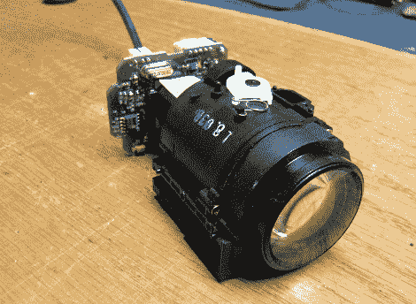

# 网络摄像头的变焦镜头

> 原文：<https://hackaday.com/2012/03/01/a-zoom-lens-for-your-webcam/>

我们需要找到像迪诺那样的朋友。一旦他们使用完这些设备，他们似乎会把所有旧的但非常棒的电子产品都丢给他。他拥有的索尼 Handycam 就是一个例子。他决定打开它，重新使用 20 倍光学变焦镜头，与网络摄像头配合使用。

我们一直喜欢(迪诺的)风格。你可以看出他不知道自己是否能够实现目标，但同时他有一种直觉，他会实现目标。在休息后的视频中，他开始研究相机中的组件。起初，镜头根本不透光，但他只是剥去一部分，直到他能看透它。

有几个伺服电机控制变焦和聚焦。他在从罗技网络摄像头连接 CCD 之前移除了这些。在视频的最后，他展示了该功能的演示，用手对焦时非常挑剔。但是我们认为这个黑客可以为焊接项目制作一个神奇的相机，它只需要一个定制的控制器，这样电机就可以再次用来调整焦距。

 <https://www.youtube.com/embed/tKS5eI-VQxM?version=3&rel=1&showsearch=0&showinfo=1&iv_load_policy=1&fs=1&hl=en-US&autohide=2&wmode=transparent>

 </body> </html>