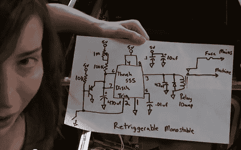

# 用于街机的自动电源电路

> 原文：<https://hackaday.com/2012/03/01/auto-power-circuit-for-an-arcade-machine/>

[杰里·埃尔斯沃思]修复的一些弹球机最终被放在了她工作单位的休息室里。我们确信她的同事对此表示感谢，但有时他们会忘记关闭机器的电源，让它们不停地运转意味着需要更频繁的维修。她着手解决这个问题，构建了一个能自动给机器供电的电路。

我们认为该解决方案增加了一些急需的功能。现在，你可以通过敲击左翻板来启动机器，而不是寻找电源开关，如果没有按下翻板按钮，大约五分钟后，机器会自动关闭。为此，她抓起一个 555 定时器芯片，并建立了一个电路来控制继电器开关电源。

她在左鳍状开关组件上增加了一个磁铁和簧片开关来控制她的附加电路。它连接到控制电阻网络和电容的 PNP 晶体管的基极。电路的这一部分(见原理图中 555 的左侧)允许定时器重新触发。也就是说，每次你按下脚蹼，555 将重置计时器。不要错过她在休息后拍摄的演示。

 <https://www.youtube.com/embed/a5tg1UuPMJw?version=3&rel=1&showsearch=0&showinfo=1&iv_load_policy=1&fs=1&hl=en-US&autohide=2&wmode=transparent>

 </body> </html>