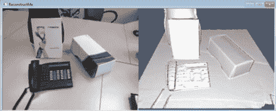

# 非常简单的 3D 扫描软件

> 原文：<https://hackaday.com/2012/03/03/very-easy-3d-scanning-software-with-reconstructme/>

[Maxzillian]提交了一个非常令人惊讶的项目，他一直在进行 beta 测试，名为[restructme](http://reconstructme.net/downloads/)。尽管这个项目只是软件开发人员对他们的工作感到厌倦的结果，但 ReconstructMe 的 3D 扫描能力有很大的潜力。

ReconstructMe 是一个软件界面，允许任何拥有 Kinect(或其他 3D 深度相机)的人站在场景前面，并在计算机上生成 3D 对象。STL 或者。OBJ 档案。这项技术的应用数不胜数，比如用 3D 打印机扫描物体进行复制，或者将自己导入视频游戏。

ReconstructMe 有一些缺点:支持的 3D 传感器只有 xBox 360 Kinect 和华硕 Xtion。还不支持 Windows 版的 Kinect。目前，ReconstructMe 仅限于扫描适合一米立方体的物体，并且只能从命令行操作，但看起来 ReconstructMe 团队正在努力支持更大的扫描。

虽然它还没有完全准备好，但它可以作为一些令人惊叹的 3D 扫描仪构建的基础。休息之后，请观看视频演示。

[https://www.youtube.com/embed/DHK6BLBJHU0?version=3&rel=1&showsearch=0&showinfo=1&iv_load_policy=1&fs=1&hl=en-US&autohide=2&wmode=transparent](https://www.youtube.com/embed/DHK6BLBJHU0?version=3&rel=1&showsearch=0&showinfo=1&iv_load_policy=1&fs=1&hl=en-US&autohide=2&wmode=transparent)

