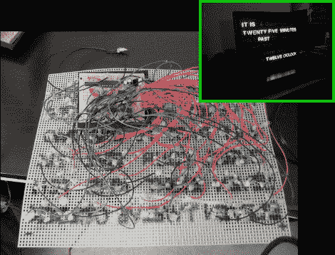

# 有趣的基板用于定位这个字钟的发光二极管

> 原文：<https://hackaday.com/2012/03/06/interesting-substrate-used-to-position-leds-of-this-word-clock/>

决定做一个单词钟作为给他父母的节日礼物。他成功了，但正如你在上面看到的，这意味着大量的点对点焊接。一小块原型板用于安装电源和一些集成电路，设备的其余部分安装在一种有趣的材料上。

支撑显示器的 LED 阵列的基底是塑料网。你可以在任何工艺品商店找到这种东西，它是用来做毛线的。它有几种不同的尺寸，用每线性英寸的孔数来表示。这太棒了，因为它让精确的间距变得轻而易举。面板本身看起来很棒，尤其是当你想到所有的字母都是手工从一块黑色泡沫板上剪下来的时候。然后将这个玻璃框放入相框中，用一点薄纸作为漫射体。

他们告诉我们，代码是用汇编语言为 ATtiny2313 微控制器编写的。它使用 DS1305 RTC 芯片来计时，您可能有兴趣了解如何在汇编中实现通信协议。这个项目是基于我们在这个链接帖子中提到的【Doug 的】单词时钟[。](http://hackaday.com/2011/03/20/hackaday-links-march-20-2011/)