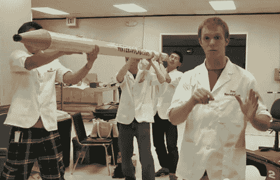

# 巨大的铅笔用作蚀刻素描手写笔

> 原文：<https://hackaday.com/2012/03/06/giant-pencil-used-as-an-etch-a-sketch-stylus/>

滑铁卢实验室的那帮人决定在普通的蚀刻素描中加入团队建设的元素。他们不再只是用自己的手套转动两个旋钮，而是将这支巨大铅笔的动作转化为素描艺术。

这里的挑战是找出一种可靠的方法来跟踪铅笔尖在空气中的移动。你可能已经猜到他们正在使用微软 Kinect 深度相机来完成这项任务。该设备的 Windows SDK 实际上有一个包装器，可以帮助它很好地与 LabView 配合使用，在 LabView 中，数据被转换为显示器的位置命令。

在蚀刻草图方面，他们选择了久经考验的技术[为玩具的每个旋钮添加齿轮和步进电机](http://hackaday.com/2012/02/06/robotic-etch-a-sketch-draws-grayscale-images/)。从休息后的视频中可以看到，结果喜忧参半。我们要说的是，从显示的 CNC“W”演示来看，当涉及到电机驱动器时，还有改进的空间。我们真的不知道 Kinect 数据转换是否如预期的那样工作。但是我们说把它装起来带到一个会议上。我们确信它会像[这个巨型版本](http://hackaday.com/2009/10/08/ik-a-sketch-collaborative-scribbling/)一样吸引很多关注。

[https://www.youtube.com/embed/WftiLoqHeZA?version=3&rel=1&showsearch=0&showinfo=1&iv_load_policy=1&fs=1&hl=en-US&autohide=2&wmode=transparent](https://www.youtube.com/embed/WftiLoqHeZA?version=3&rel=1&showsearch=0&showinfo=1&iv_load_policy=1&fs=1&hl=en-US&autohide=2&wmode=transparent)

[谢谢梅根]